<div align="center">



<br/>

[](https://www.python.org/)
[](https://modelcontextprotocol.io/)
[](https://modelcontextprotocol.io/)
[](https://support.google.com/mail)
[](LICENSE)

<br/>

**A production-ready Model Context Protocol (MCP) server that empowers AI assistants (Antigravity, Claude, Cursor, Gemini) to securely read, draft, send, categorize, and organize Gmail with 14 specialized tools.**

[Key Features](#-key-features) • [Tool Reference](#-tool-reference) • [Setup Guide](#-step-by-step-setup-guide) • [Integration](#-client-integration) • [Prompts](#-example-ai-prompts)

---

</div>

## 🌟 Key Features

* **⚡ 14 Comprehensive MCP Tools:** Full email lifecycle management from reading headers and attachments to drafting, sending, thread-replying, and mailbox analytics.
* **🔒 Enterprise-Grade Security:** Pure IMAP/SMTP over SSL (Port 993/465). No Google Cloud API quota limits, and zero hardcoded credentials.
* **🧠 Built-in AI Mailbox Intelligence:** Automatically classifies incoming emails into actionable business buckets (*Action Required, Meetings, Receipts & Orders, Newsletters, Direct Discussions*).
* **✉️ Smart Thread-Aware Replies:** Seamlessly replies to active email threads preserving `In-Reply-To`, `References`, and `Subject` chains.
* **📎 Rich Multi-part & Attachment Handling:** Native support for plain text, HTML emails, and custom binary/document attachments (`.pdf`, `.zip`, `.png`, `.xlsx`, etc.).
* **🚀 MCP 2.x Architecture:** Fully compatible with the modern Model Context Protocol Python SDK 2.x standard (`mcp.server.mcpserver.MCPServer`).

---

## 🛠️ Tool Reference

| # | Tool Name | Description | Key Parameters |
|---|---|---|---|
| `1` | **`read_inbox`** | Fetches recent email headers from Inbox or any folder | `limit` (int), `unread_only` (bool), `folder` (str) |
| `2` | **`get_email_details`** | Reads full message content, body text, HTML, and attachment list | `message_id` (str), `folder` (str) |
| `3` | **`search_emails`** | Searches across `Subject`, `From`, and `Body` using IMAP filters | `query` (str), `folder` (str), `limit` (int) |
| `4` | **`send_email`** | Sends plain text and HTML emails dynamically | `to` (str), `subject` (str), `body` (str), `cc`, `bcc`, `html_body` |
| `5` | **`send_email_with_attachment`** | Sends an email with any local file attachment | `to` (str), `subject` (str), `body` (str), `file_path` (str), `cc`, `html_body` |
| `6` | **`reply_to_email`** | Replies directly to an email thread preserving thread headers | `message_id` (str), `reply_body` (str), `folder` (str), `html_reply_body` |
| `7` | **`create_draft`** | Saves a draft email directly inside Gmail's `[Gmail]/Drafts` folder | `to` (str), `subject` (str), `body` (str), `html_body` |
| `8` | **`list_drafts`** | Lists pending drafts with Subject, Date, and ID | `limit` (int) |
| `9` | **`delete_email`** | Moves single or comma-separated batch email IDs to Trash or purges | `message_id` (str), `folder` (str), `move_to_trash` (bool) |
| `10` | **`clean_bounce_notifications`** | Detects and removes automated `mailer-daemon` failure emails | `folder` (str) |
| `11` | **`categorize_emails`** | AI heuristics classifier for inbox sorting | `limit` (int), `folder` (str) |
| `12` | **`generate_followup_template`** | Creates contextual follow-up emails based on sent messages | `original_subject_or_to` (str), `context_notes` (str), `sender_name` (str) |
| `13` | **`manage_labels`** | Stars, unstars, marks read/unread, or attaches custom labels | `message_id` (str), `label_action` (str), `label_name` (str) |
| `14` | **`get_mailbox_stats`** | Real-time counts for Inbox, Unread, Sent, Drafts, and SSL status | *None* |

---

## 🚀 Step-by-Step Setup Guide

### 1. Prerequisites
* Python **3.10** or newer installed on your machine.
* A standard **Gmail / Google Workspace** account.

### 2. Generate Gmail App Password (1 Minute)
Because Gmail restricts direct password logins, you need an **App Password**:
1. Go to your [Google Account Security Settings](https://myaccount.google.com/security).
2. Enable **2-Step Verification** (if not already enabled).
3. In the search bar at the top, type **"App Passwords"** or go directly to [App Passwords](https://myaccount.google.com/apppasswords).
4. Enter an App name (e.g., `Antigravity MCP` or `Gmail Manager`) and click **Create**.
5. Copy the generated **16-character password** (e.g., `abcd efgh ijkl mnop`).

### 3. Installation

Clone this repository and install dependencies:

```bash
# Clone the repository
git clone https://github.com/satyamkumar420/gmail-manager.git
cd gmail-manager

# Install MCP SDK
pip install -r requirements.txt
```

*(Or install directly via `pip install mcp`)*

---

## ⚙️ Client Integration

### 1. Antigravity (`agy` / `mcp_config.json`)

Add the following configuration to your `mcp_config.json` or Antigravity configuration:

```json
{
  "mcpServers": {
    "gmail-manager": {
      "command": "python",
      "args": ["D:/MCP/gmail-manager/server.py"],
      "env": {
        "GMAIL_SENDER_EMAIL": "your_email@gmail.com",
        "GMAIL_APP_PASSWORD": "your-16-char-app-password"
      }
    }
  }
}
```

### 2. Claude Desktop (`claude_desktop_config.json`)

On **Windows**: `%APPDATA%\Claude\claude_desktop_config.json`  
On **macOS**: `~/Library/Application Support/Claude/claude_desktop_config.json`

```json
{
  "mcpServers": {
    "gmail-manager": {
      "command": "python",
      "args": ["/absolute/path/to/gmail-manager/server.py"],
      "env": {
        "GMAIL_SENDER_EMAIL": "your_email@gmail.com",
        "GMAIL_APP_PASSWORD": "your-16-char-app-password"
      }
    }
  }
}
```

### 3. Cursor / Custom MCP Client

```json
{
  "name": "gmail-manager",
  "command": "python server.py",
  "env": {
    "GMAIL_SENDER_EMAIL": "your_email@gmail.com",
    "GMAIL_APP_PASSWORD": "your-16-char-app-password"
  }
}
```

---

## 💡 Example AI Prompts

Once connected to your AI assistant, you can issue natural language commands:

```text
💬 "Check my unread emails from today and summarize any urgent tasks."
```
```text
💬 "Search for an email from 'John' regarding the 'Project Proposal' and show its details."
```
```text
💬 "Reply to message ID 4521 saying that I have reviewed the document and approved it."
```
```text
💬 "Send an email to client@example.com with the subject 'Quarterly Report' and attach ./report.pdf."
```
```text
💬 "Categorize my last 20 emails and show me items requiring immediate attention."
```
```text
💬 "Clean up all mailer-daemon bounce notifications from my inbox."
```
```text
💬 "Give me a quick breakdown of my mailbox statistics."
```

---

## 📁 Repository Structure

```
gmail-manager/
├── banner.svg           # High-resolution vector banner for repo hero
├── server.py            # Main MCP Server implementation (14 tools, MCP 2.x)
├── requirements.txt     # Python dependencies (mcp>=2.0.0)
├── .env.example         # Template for environment variables
└── README.md            # Documentation & setup instructions
```

---

## 🛡️ Security Best Practices

* **Never commit `.env` or credentials** to version control.
* This server connects directly via **TLS/SSL** to Google's official endpoints (`imap.gmail.com:993`, `smtp.gmail.com:465`).
* All operations are scoped strictly to the authenticated Gmail account.

---

## 📄 License

This project is licensed under the **MIT License** - see the [LICENSE](LICENSE) file for details.

<div align="center">
  <sub>Built with ❤️ by <a href="https://github.com/satyamkumar420">satyamkumar420</a> for Antigravity &amp; the Model Context Protocol ecosystem.</sub>
</div>
